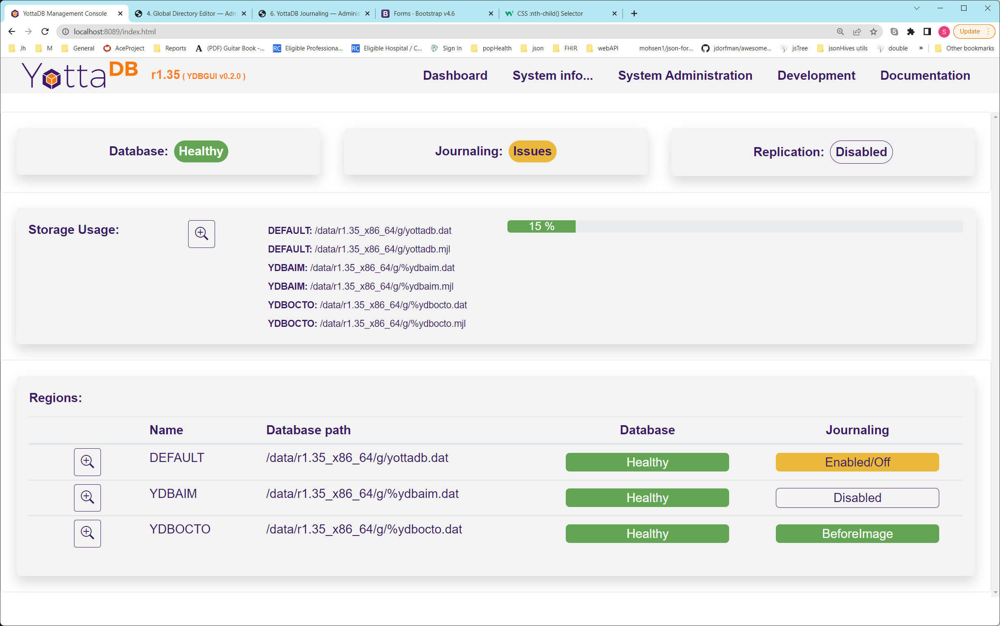

<!--
/****************************************************************
 *                                                              *
 * Copyright (c) 2022 YottaDB LLC and/or its subsidiaries.      *
 * All rights reserved.                                         *
 *                                                              *
 * This source code contains the intellectual property          *
 * of its copyright holder(s), and is made available            *
 * under a license.  If you do not know the terms of            *
 * the license, please stop and do not read further.            *
 *                                                              *
 ****************************************************************/
-->

# YDBGUI

YottaDB GUI

## Getting started

## Installation

## REST Api

The web server exposes a collection of REST endpoints for you to use to embed the YDBGUI functionality in your application.

A full description of the API can be found [here](docs/rest.md) 

## License

This software is released under the terms of the  [GNU Affero General Public License version 3](https://www.gnu.org/licenses/agpl-3.0.txt)

