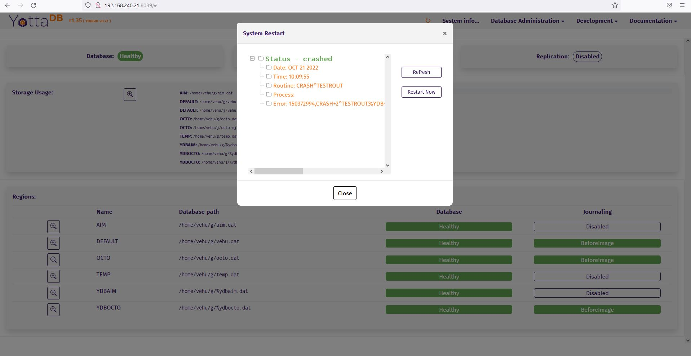

<!--
/****************************************************************
 *                                                              *
 * Copyright (c) 2022 YottaDB LLC and/or its subsidiaries.      *
 * All rights reserved.                                         *
 *                                                              *
 * This source code contains the intellectual property          *
 * of its copyright holder(s), and is made available            *
 * under a license.  If you do not know the terms of            *
 * the license, please stop and do not read further.            *
 *                                                              *
 ****************************************************************/
-->

# YDBGUI

YottaDB GUI

This particular fork contains additional code to integrate a bespoke application restart into the GUI



<hr>

# Getting started

## Pre-requisites

* YottaDB Installation
* The Linux utilities `df`, `stat`, `rm`, `cp`, `fuser`, `grep`

## Installation
Installation is done using cmake in the build directory, created in the source directory,
and then running make and make install (using sudo if needed). Here's an example of how
to do it:

```
mkdir build && cd build
cmake .. && make && sudo -E make install
```

The main artifacts that are installed are:
- `_ydbmwebserver.so` in the `plugin/o` directory (and a version for utf8)
- `_ydbgui.so` in the `plugin/o` directory (and a version for utf8)
- The HTML/JS/CSS files (all static) in `plugin/etc`

## Starting the GUI
You need at least 3 envionment variables set-up before starting the GUI:

 - `ydb_dist`
 - `ydb_gbldir`
 - `ydb_routines`

The GUI relies on the environment variables `ydb_gbldir` to figure out what set
of databases it is going to use. You need to set this up appropriately before
starting the GUI.

`ydb_routines` needs to contain the files
`$ydb_dist/plugin/o/[utf8/]_ydbmwebserver.so` and
`$ydb_dist/plugin/o/[utf8/]_ydbgui.so`. This can be automatically done by
setting up your `ydb_routines` to contain your directories and then sourcing
`$ydb_dist/ydb_env_set`.

Once you set-up these variables, you can start the GUI by doing this (port is
optional; the default is 8089):

```
$ydb_dist/yottadb -r %ydbgui [--port nnnn]
```

Once started, visit port 8089 on a web browser on the machine hosting the
YottaDB GUI (http://localhost:8089 if you are doing this on your computer).

## Stopping the GUI
Use `stop^%ydbgui`. Note that we need the utility `fuser` to determine the
process that we need to stop, and this needs to be installed before hand.
```
$ydb_dist/yottadb -r stop^%ydbgui 
```

## Using the Dockerfile
Instructions for using the Dockerfile are embedded as comments there.

## Executing the Unit Tests
Instructions for executing Unit Tests and re-generate the test list are to be found [here](docs/testing.md) 

## REST Api
The web server exposes a collection of REST endpoints for you to use to embed the YDBGUI functionality in your application.

A full description of the API can be found [here](docs/rest.md) 

## License
This software is released under the terms of the  [GNU Affero General Public License version 3](https://www.gnu.org/licenses/agpl-3.0.txt)
